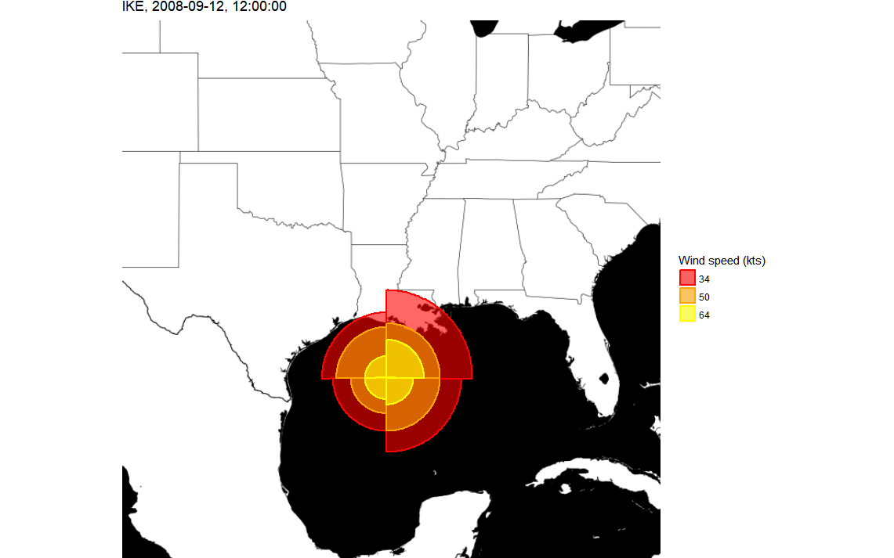

`geom_hurricane` is a customized version of the [ggplot2 Polygon](http://ggplot2.tidyverse.org/reference/geom_polygon.html) geom, designed for plotting wind speed radii information. See the [extended best track](http://rammb.cira.colostate.edu/research/tropical_cyclones/tc_extended_best_track_dataset/) dataset for more information.

As part of the programming assignment for the Coursera class [Building Data Visualization Tools](https://www.coursera.org/learn/r-data-visualization/), an example plot is included as follows:

